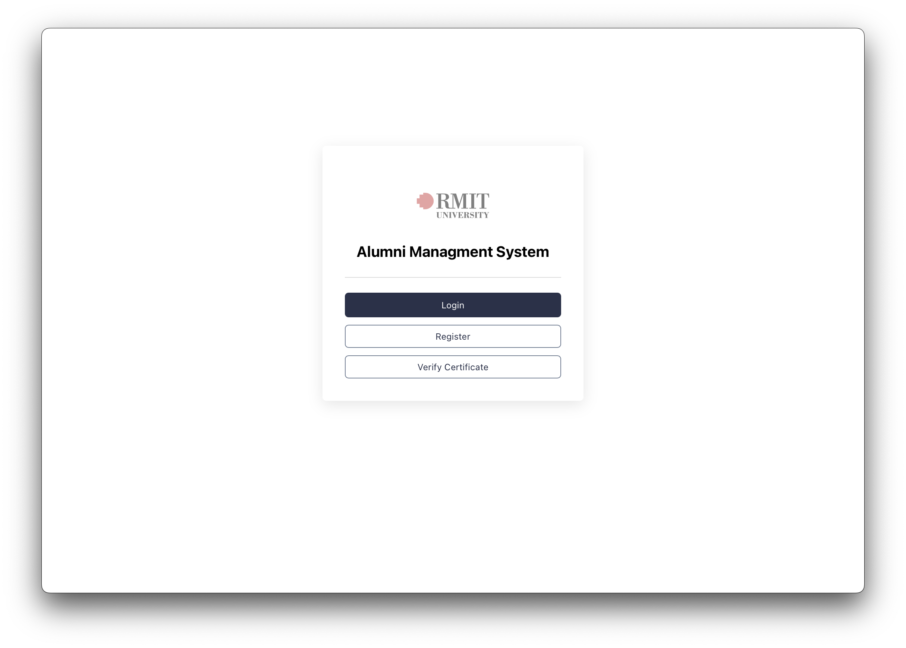

# Description

This is a basic version of an Alumni management system. It demonstrates some security aspects in a web applications such as:

- Authorisation and authentication.
- Role-based access control.
- Password hashing.
- Enforcing HTTPs protocol for a secure communication between the client and the server by getting an SSL certificate and configure NGINX in the production environment to use it. (production server is no longer active)

Functionalities based on role:

- Admin users can add new alumni records into the system and see the list of all alumni records and download their certificates.
- Alumni users can only see and download their certificates.
- Guest users can verify certificates by their IDs.

# Showcase

Home page

Login as admin user

Verify certificate by guess users

